## 17. EBLG Goals and Constraints

Primary goals:

- Preserve institutional legal expertise
- Improve precedent retrieval and drafting speed
- Maintain strict confidentiality boundaries
- Provide board-level confidence in controls and portability

Key constraints:

- Sensitive matter data and restricted repositories
- Need for clear architecture/process documentation
- Need to avoid black-box dependency patterns

---

## 18. EBLG Scope Policy (Initial)

### 18.1 In Scope (Initial Recommendation)

- Unrestricted Perfect Law matter files
- Matter-linked curated emails already in approved repositories
- Approved OneDrive document sets and templates
- Approved transcripts and partner-knowledge capture artifacts
- Authoritative reference corpora needed for workflow grounding

### 18.2 Out of Scope (Initial Recommendation)

- Restricted admin repositories unless explicitly approved
- Full mailbox sweeps without matter and policy gating
- Personal/non-business content

### 18.3 Hold Zone

Data under evaluation for future inclusion:

- Sensitive internal correspondence outside approved matter context
- Legacy files with unresolved permission ambiguity

---

## 19. EBLG Chart of Knowledge Starter

Starter taxonomy dimensions:

- Practice domain
- Matter type
- Workflow type
- Document class
- Legal authority class
- Jurisdiction
- Confidentiality class
- Lifecycle stage

This starter should be reviewed by EBLG legal and operations leads before full rollout.

---

## 20. EBLG Knowledge Card Specification (v1)

Required fields:

- Card ID
- Source system and source object ID
- Matter ID
- Document title/type/date/author
- Confidentiality class and ACL policy pointer
- Taxonomy tags
- Processing depth status
- Extraction quality score
- Citation readiness flag
- Version and lineage links

Optional fields:

- Workflow affinity tags
- Review owner
- Retention category

---

## 21. EBLG Indexing and OCR Policy (v1)

### 21.1 Indexing Decision

Adopt phased hybrid indexing:

- Build historical baseline on approved high-value corpus
- Index all new approved content incrementally
- Backfill based on observed retrieval gaps

### 21.2 OCR Rules

- Do not OCR all PDFs by default
- OCR only where native extraction quality fails thresholds
- Prioritize OCR budget for high-value, high-query assets
- Use page-level OCR where possible

### 21.3 Quality Gates Before Expansion

- Citation correctness threshold met
- Retrieval benchmark performance met
- Access-control checks pass
- Human-review policy functioning reliably

---

## 22. EBLG Workflow Pack (Initial)

Proposed v1 workflows:

1. Precedent retrieval and reasoning-chain synthesis  
2. Memo and opinion-letter first draft generation  
3. Due diligence issue spotting and categorization  
4. Transaction analysis and chart drafting support  
5. Outdated advice and regulatory-impact checks  

Each workflow requires:

- Input contract
- Output schema
- Citation requirements
- Human review checkpoint
- Escalation rules

---

## 23. Kevin Concern Traceability Matrix

This matrix maps Kevin's stated concerns to manual controls.

| Kevin concern theme | Manual control |
|---|---|
| Avoid black box systems | Sections 2, 12 (openness, API/export/exit) |
| Use non-negotiables rubric | Sections 2, 13, 23 |
| Clarify RAG/indexing approach | Sections 8, 21 |
| Distinguish Peninsula vs core systems | Sections 2.3, 3, 18 |
| Private AI with citations + human review | Sections 2.4, 9, 10, 11 |
| Confidentiality and selective access | Sections 11, 18, 20 |
| Architecture and process documentation | Entire standard layer + EBLG profile |
| Phased custom modules | Sections 2.5, 15.2 |

---

## 24. Open Decisions for EBLG

1. Final list of restricted repositories excluded from v1  
2. Exact role model for permission matrix  
3. Workflow priority order for first production release  
4. Threshold values for usefulness scoring and OCR triggers  
5. Acceptance criteria values for quality gates  
6. Scope of multi-LLM comparative runs in production  
7. Formal export package definition for board governance  

---

## 25. EBLG Board and Operator FAQ (Initial)

### 25.1 Do we need to retro-index everything?

No. Use phased hybrid indexing: baseline high-value history, incremental forward indexing, targeted backfill.

### 25.2 Is Peninsula replacing our core systems?

No. Peninsula is the governed knowledge layer above existing systems-of-record.

### 25.3 Can confidential data be restricted by person and matter?

Yes, with role and matter-level policy filters enforced before retrieval.

### 25.4 Can we export our data and avoid lock-in?

Yes, export readiness is a non-negotiable and should be validated in implementation.

### 25.5 Do all files require OCR?

No. OCR is selective and driven by quality and value signals.

### 25.6 How are hallucinations reduced?

By retrieval grounding, citation requirements, strict source controls, and human review gates.

---

## Appendix A: Visual Architecture Map

```mermaid
flowchart LR
  S["Source Systems"] --> G["Governance Gates"]
  G --> T["Taste System: Use Hold Exclude"]
  T --> P["Processing Depth L0 L1 L2 L3"]
  P --> K["Knowledge Cards + Taxonomy"]
  K --> I["Hybrid Index Layer"]
  I --> R["Retrieval + Reranking"]
  R --> L["LLM Synthesis"]
  L --> A["Agent Workflows"]
  A --> H["Human Review Gates"]
  H --> O["Approved Output + Audit"]
  O --> F["Feedback Loop and Reindex"]
  F --> T
```

---

## Appendix B: Knowledge Card Example (Compact)

| Field | Example |
|---|---|
| Card ID | KC-EBLG-000245 |
| Source | Perfect Law |
| Source Object ID | MAT-2015-ASF-0441-DOC-12 |
| Matter | ASF-2015-0441 |
| Document Type | Opinion letter |
| Confidentiality | Confidential matter |
| Taxonomy Tags | IRC404a9, affiliated-service-group, community-property |
| Processing Depth | L3 |
| Extraction Quality | 0.93 |
| Citation Ready | Yes |
| ACL Policy | EBLG-MATTER-CONF-ROLESET-03 |

---

## Appendix C: Manual Maintenance Rule

This manual is living documentation.

Update triggers:

- Scope changes
- New modules/workflows
- Security/control changes
- Benchmark failures or major tuning changes
- Board governance requests

Version every change with owner and rationale.

